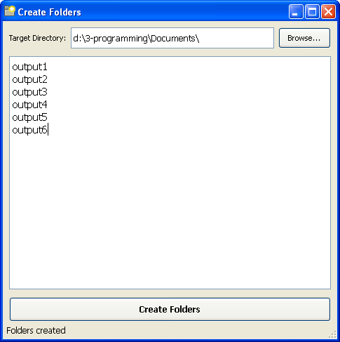

# Create Folders

Creates folders in the selected directory from the text list

## Usage

- Paste the path into the field or browse for a folder
- Enter or paste the list of folders into the textarea
- Press **Create Folders**
- To create subfolders separate them with slashes (/ or \) in a single line

## Shortcuts

- **Ctrl+Q** - Create Folders
- **Ctrl+O** - Browse
- **Esc** - Exit
